% Visualization of machine learning algorithms
% Thomas Torsney-Weir
% VDA research group, University of Vienna

## Outline

* Introduction to Machine learning
* Vis helping machine learning
* Machine learning helping vis

## What is machine learning?

> "A rational agent is one that acts so as to achieve the best
> outcome or, when there is uncertainty, the best expected
> outcome" 

[@Russel:2010]

Algorithms that can improve their performance based on training data

## What is machine learning?

<aside class="notes">
Let's say you want to help your friend Isaac Newton figure out 
how to dodge apples
</aside>

## What is machine learning?

<aside class="notes">
Record data on behavior, come up with a model. This was done in the past!
This is hard!
</aside>

## What is machine learning?

<aside class="notes">
So we can replace the human. Computers are good at processing data!
</aside>

## What is machine learning?

<aside class="notes">
So we can just use a machine learning algorithm to replace the model for us!
How does this work?
</aside>

## Types of algorithms

* Regression
* Classification
* Clustering

<aside class="notes">
go over types of algorithms, ask about tasks.
</aside>

## What to use?

* Regression: Predict continuous values
* Classification: Predict discrete values
* Clustering: Find distributions

<aside class="notes">
People often confuse clustering as classification where they don't 
know the classes
</aside>

## Regression

[@Bishop:2006]

## Regression

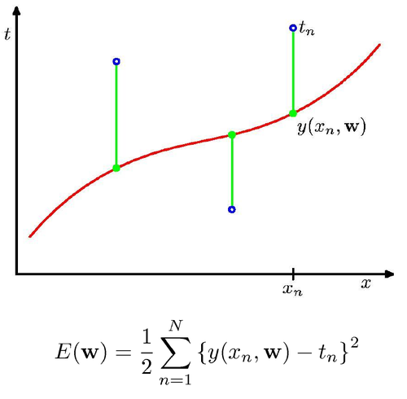

[@Bishop:2006]

## Regression

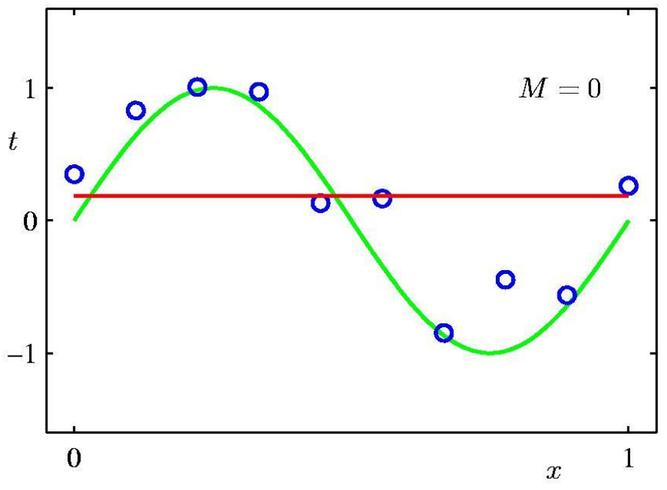

[@Bishop:2006]

## Regression

[@Bishop:2006]

## Regression

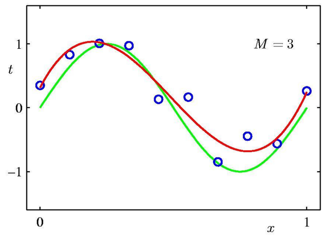

[@Bishop:2006]

## Regression

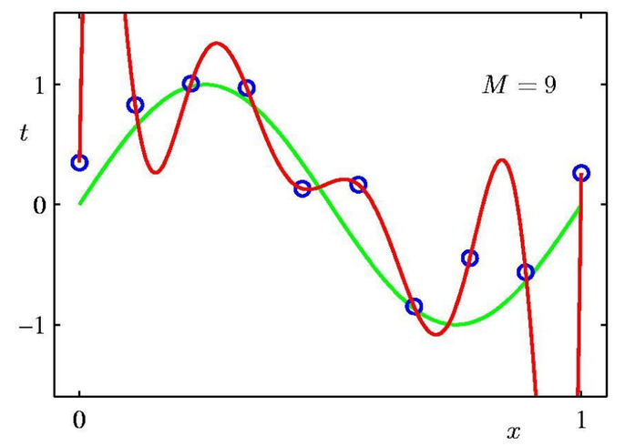

[@Bishop:2006]

## Regression

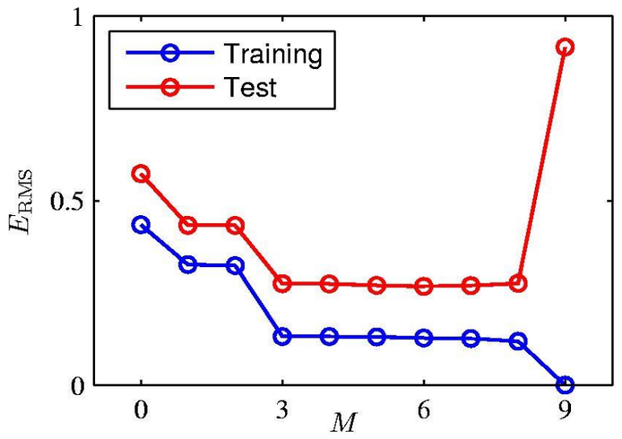

[@Bishop:2006]

## Classification

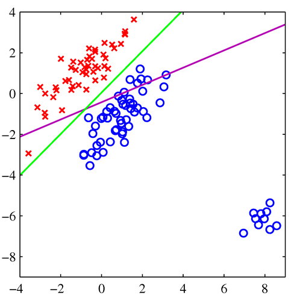

[@Bishop:2006]

## Clustering

[@Bishop:2006]

## Clustering

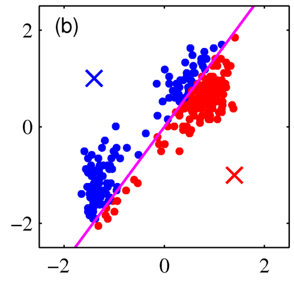

[@Bishop:2006]

## Clustering

[@Bishop:2006]

## Clustering

[@Bishop:2006]

## Clustering

[@Bishop:2006]

## Clustering

[@Bishop:2006]

## Uses

* naive Bayes: spam filtering
* classification: recommender systems
* neural networks: handwriting recognition
* HMM: speech recognition

## Vis and ML

* both vis and ML seem to have similar goals: make sense of complex data

  

    <h3>Machine learning</h3>
    
  

  

    <h3>Visualization</h3>
    
    [@Morton:2012]
  

## Who helps whom?

### both!

* Vis helps ML: evaluating models
* ML helps vis: ML for embedded analysis

## Now to the vis part

How do they work together?

* Building models
* Validating models
* Understanding models
* Embedding ML algorithms

# Building models

## What are meta parameters?

Meta parameters control how learning takes place

* Learning rate
* Number and size of network layers
* Slack variables
* Stopping conditions

## Why study meta-parameters?

  

     
  

  

    
  

<aside class="notes">
So let's talk about image segmentation
</aside>

## Why study meta-parameters?

  

     
  

  

    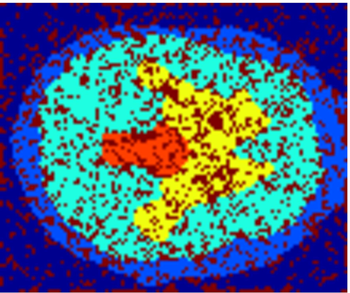
  

<aside class="notes">
Same algo different params
</aside>

## Manual method

<figure>

</figure>

## Manual method

<figure>

</figure>

## How to study them?

run a bunch of models and examine outputs

* design galleries
* paramorama

<aside class="notes">
Works well when you have no real metric for what you're looking for
</aside>

## Design galleries

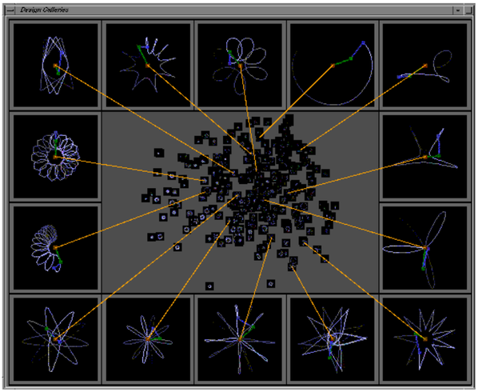

[@Marks:1997]

## Design galleries

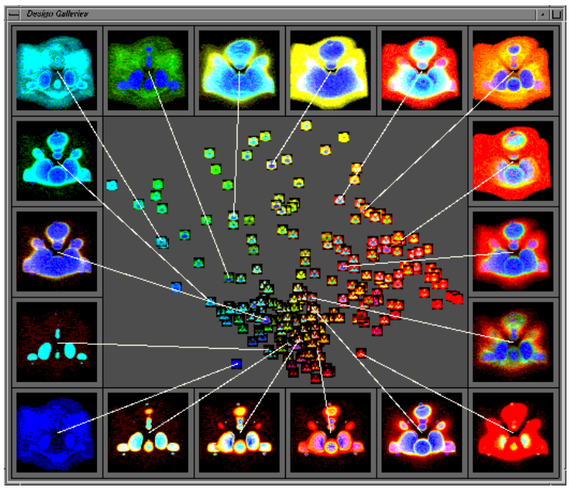

[@Marks:1997]

## Paramorama

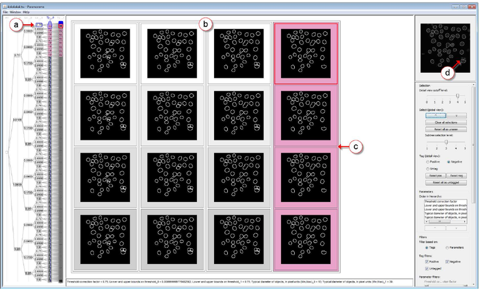

[@Pretorius:2011]

## How to study them?

use a more principled approach

* Tuner

## Objective measures

<figure>

</figure>

## Visual parameter space exploration

* intro
* conceptual pipeline

<figure>

</figure>

  Michael Sedlmair, Christoph Heinzl, Stefan Bruckner, Harald Piringer, and Torsten Möller
  &quot;Visual parameter space analysis: A conceptual framework&quot;
  IEEE Transactions on Visualization and Computer Graphics. 20(12) 2014.

## Tuner

<figure>

</figure>

[@Torsney-Weir:2011]

# Validating and verifying models

## What do we mean?

* How do we know our models are working?
* model selection

[@UQreport:2012]

## Examples

* HyperMoVal - local inspection
* Sliceplorer - global inspection
* Tuner - error inspection

## HyperMoVal

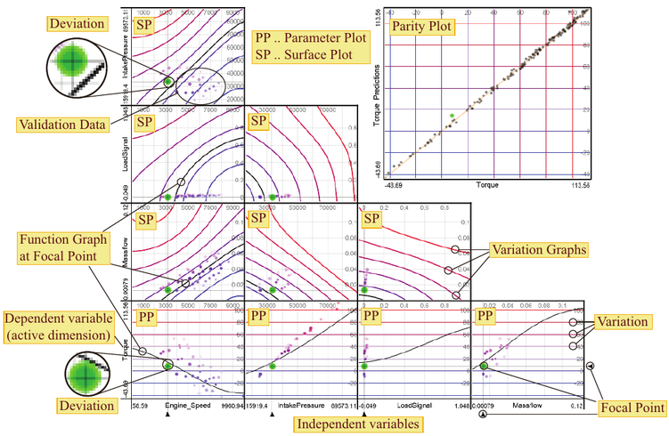

[@Piringer:2010]

## Sliceplorer views

* show the ML algorithm example

## Tuner error views

Examining multi-dimensional functions

* error view shows where model is unsure
* can visually verify the model

# Understanding models

## Who needs this?

* models are complex
* the business world likes spreadsheets because they can 
  walk through the calculations

## Simple vs complex models

  

    ### Simple

    * small integer factors
    * small number of factors
    * low-depth trees
  

  

    ### Complex

    * multi-layer neural network
    * gaussian process model
    * tSNE
    * non-linear
    * many decisions
  

<aside class="notes">
Think about tutorials, etc to learn complex systems. These complex ML 
algorithms are trying to replicate these systems in some sense
</aside>

## What does complexity buy us?

* Global vs local models
* Deep-learning networks can deal with feature selection
* Can deal with edge cases

<aside class="notes">
- ask the students what is the simplest classifier they can think of
- simplest classifier: pick the most frequent class
</aside>

## Methods

* interaction
* walkthroughs
* simpler models ala LIME [@cite]

## Examples

* regression: Muhlbacher and Piringer
* clustering: Dis-function
* text processing: TagRefinery
* smaller models: NYU paper

## A partition-based framework for building and validating regression models

[@Muhlbacher:2013]

## Dis-function

[@Brown:2012]

## TagRefinery

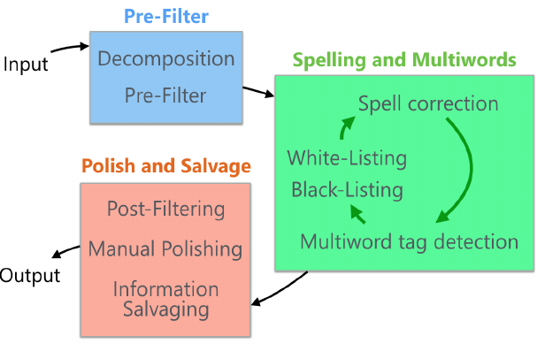

[@Kralj:2017]

## TagRefinery

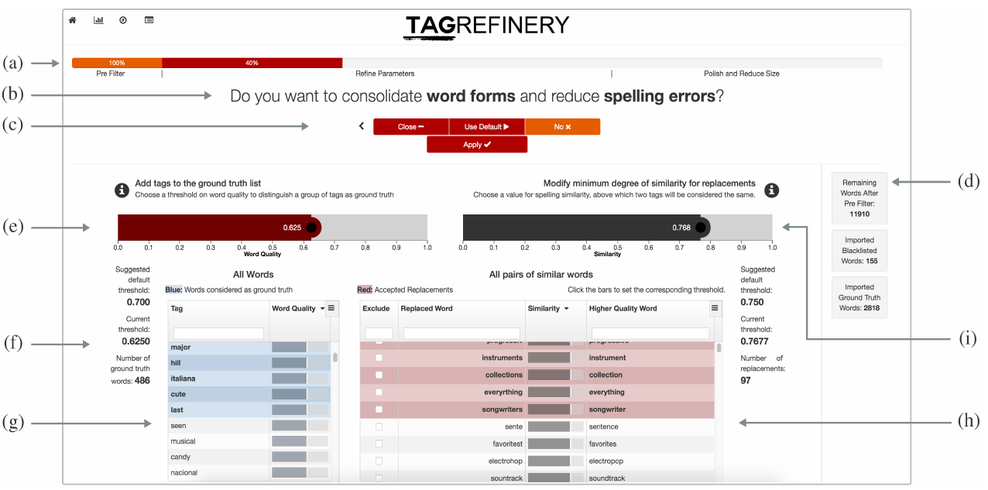

[@Kralj:2017]

## TagRefinery

[@Kralj:2017]

## NYU paper

# Machine learning helping vis

## How?

[@Sacha:2014]

* Use the strengths of ML and vis together
    - machines are good at calculating
    - humans are good at intuition
* Vis assisted by ML algorithms

## Book ad!

## Clustering

* Cluster and calendar view
* KeyVis
* FluidExplorer

## Cluster and calendar view

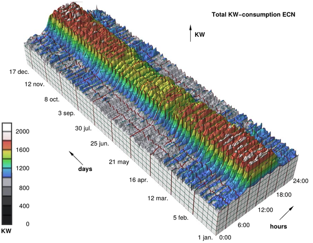

[@Van-Wijk:1999]

## Cluster and calendar view

[@Van-Wijk:1999]

## Cluster and calendar view

[@Van-Wijk:1999]

## KeyVis

goal: find relevant papers

## KeyVis

step 1: cluster the papers based on keywords

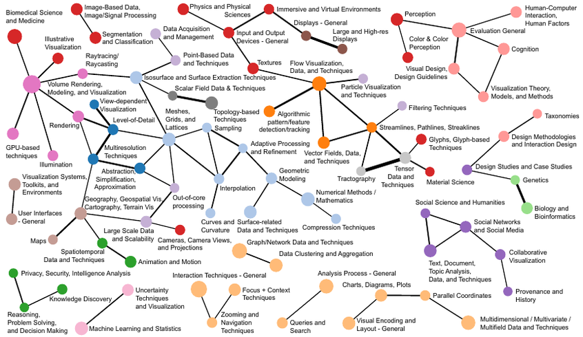
[@Isenberg:2017]

## KeyVis

step 2: give an interface to this clustering

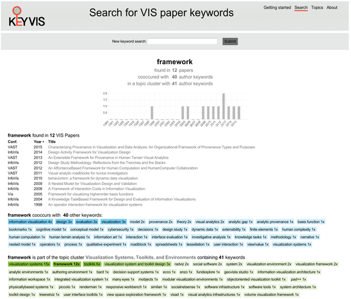
[@Isenberg:2017]

## FluidExplorer

[@Bruckner:2010]

## FluidExplorer

[@Bruckner:2010]

## FluidExplorer

[@Bruckner:2010]

## Classification

any?

# The future!

## Interesting projects

* More using ML to build models for vis tools
* More generalized tools

<aside class="notes">
Active learning

Many tools are specific to a type of model
</aside>

## Thanks!

thomas.torsney-weir@univie.ac.at

http://www.tomtorsneyweir.com

